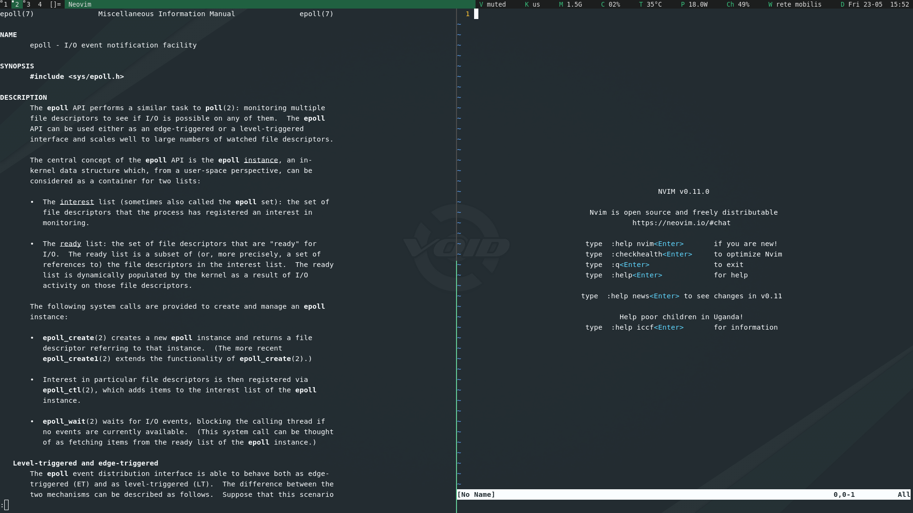
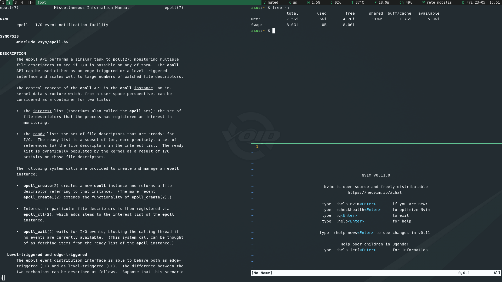

### Description
This patch replaces the window borders of tiled windows with borders that are similar to those found in tmux. The result is that there are no more unnecessary borders along the monitor edges in tiled mode. Borders of floating windows are not affected.

### Preview

### Download
- [git branch](/kerberoge/dwl/src/branch/tmux-borders) 
- [0.7](/dwl/dwl-patches/raw/branch/main/patches/tmux-borders/tmux-borders-0.7.patch)

### Authors
- [kerberoge](https://codeberg.org/kerberoge)\
  kerberoge at [dwl Discord](https://discord.gg/jJxZnrGPWN)
